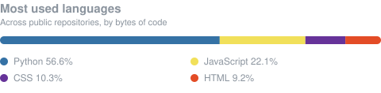

# Rayan Madi

**Full-stack developer**, 3rd year of a Bachelor's degree, Paris.

I build web applications end to end: interfaces, APIs, databases, deployment.
These days most of my time goes to real-time systems and to running language models locally.

**Looking for a 12-month apprenticeship starting September 2026.** Three weeks in company, one week at school, Paris area.

---

### Stack

|  |  |
|---|---|
| **Languages** | Python · TypeScript / JavaScript · PHP · Java · SQL |
| **Back-end** | Node.js / Express · Django · Flask |
| **Front-end** | React · Three.js · HTML / CSS |
| **Databases** | MySQL · NoSQL |
| **Tools** | Git · Docker · Linux · PowerShell |

---

---

### Elsewhere

[Portfolio](https://madirayanportfolio.netlify.app) · [LinkedIn](https://www.linkedin.com/in/rayan-madi) · madirayan75015@gmail.com

Paris. Pinned repositories below.
